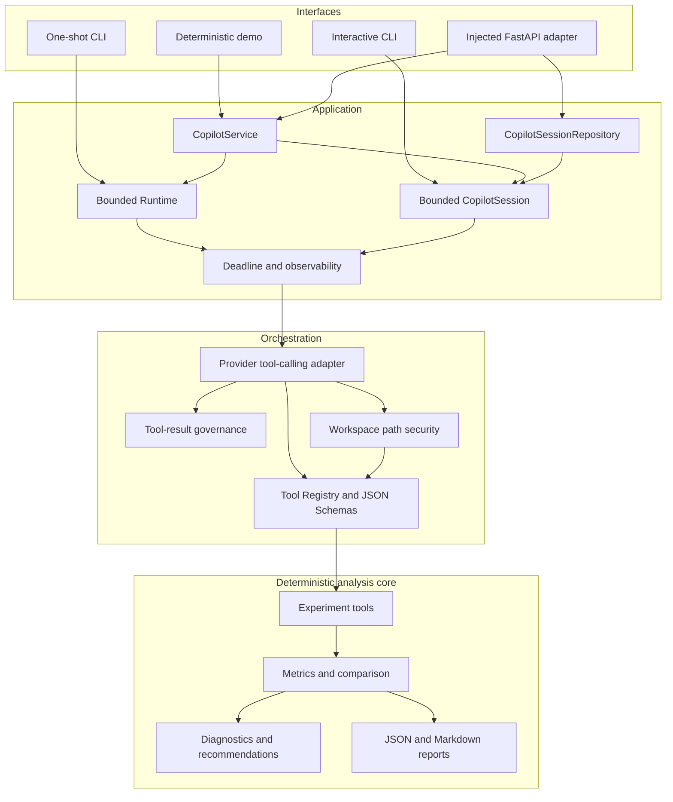

# Multimodal Experiment Copilot

**A general-purpose experiment analysis and decision Copilot for machine-learning engineering teams.**

Multimodal Experiment Copilot turns experiment configurations and metric histories into reproducible comparisons, diagnostics, recommendations, and grounded Copilot answers. Deterministic Python code owns the analysis; an optional language model can select approved tools and explain their results.

It is not a generic ChatGPT wrapper, and it is not limited to one dataset or task. The included FI personality-recognition fixture is a real-world case study, while the analysis and orchestration layers are designed for general ML experiments.

## Why this project is different

- **Deterministic analysis first.** YAML/JSON parsing, metric evaluation, ranking, diagnostics, and recommendations do not depend on an LLM.
- **Grounded model orchestration.** A model can call only registered tools with explicit JSON Schemas; it does not reimplement experiment analysis in prose.
- **Bounded execution.** Provider requests, tool cycles, session history, tool-result size, and turn time are constrained.
- **Host-controlled capabilities.** The host defines the trusted experiment workspace and runtime policy. Model-generated paths cannot expand that authority.
- **Multiple interfaces, one core.** Pure Python tools, one-shot and interactive CLIs, a thin service facade, and an injected FastAPI adapter reuse the same runtime.
- **SDK-free core.** Provider integration is optional and isolated behind a client/adapter boundary.

## Current capabilities

- Read `hparams.yaml` configurations and `history.json` metric histories.
- Evaluate built-in or YAML-configured metrics with maximize/minimize semantics.
- Analyze one experiment or compare and rank multiple experiments.
- Produce JSON-native summaries, Markdown reports, diagnostics, and recommendations.
- Continue multi-experiment analysis when an individual experiment fails.
- Expose `analyze_experiment` and `compare_experiments` through a vendor-neutral Tool Registry and JSON Schemas.
- Execute bounded single-cycle and multi-turn tool-calling flows.
- Enforce workspace path capabilities for experiment directories and metric configuration files.
- Limit serialized tool results to 256 KiB each and 512 KiB per tool cycle; results are rejected rather than truncated or summarized.
- Apply provider timeouts and Copilot turn-deadline checkpoints.
- Report payload-free failure observations while preserving the original exception.
- Maintain bounded in-memory sessions with JSON-safe transcript export.
- Manage process-local sessions through `CopilotSessionRepository`.
- Offer a borrowed-client `CopilotService` facade.
- Embed the system through an injected, serialized FastAPI adapter.

## Architecture



The adapter translates provider tool calls into Registry dispatch. The Registry exposes copied provider schemas and immutable path-capability descriptors, while the deterministic core remains callable without any provider.

## Quick start: credential-free deterministic demo

Python 3.11 is the supported baseline.

```bash
python -m pip install -r requirements.txt
python examples/deterministic_copilot_demo.py
```

The demo:

- requires no API key and performs no network access;
- creates two small synthetic experiments in temporary storage;
- uses a deterministic fake provider compatible with the real adapter;
- traverses `CopilotService → Runtime → Adapter → Path Security → Tool Registry`;
- invokes the real `compare_experiments` tool with diagnostics enabled;
- prints stable, recursively JSON-native output.

See the checked-in representative result at [`examples/deterministic_copilot_demo_output.json`](examples/deterministic_copilot_demo_output.json).

## Installation

Install the project, analysis, HTTP, and test dependencies:

```bash
python -m pip install -r requirements.txt
```

The optional OpenAI-compatible provider client is deliberately separate:

```bash
python -m pip install -r requirements-openai.txt
```

Set `OPENAI_API_KEY` only when using a real provider. The deterministic core and demo do not read it.

PowerShell:

```powershell
$env:OPENAI_API_KEY = "<your-api-key>"
```

Bash:

```bash
export OPENAI_API_KEY="<your-api-key>"
```

## Copilot interfaces

### One-shot CLI

Ask one question about an experiment directory:

```bash
python -m copilot \
  --model "<model>" \
  --question "Summarize the strongest validation result and any risks." \
  --experiment-dir examples/demo_experiment
```

Supported optional flags are `--experiment-dir`, `--base-url`, and `--timeout`. The CLI constructs and closes its provider client, runs one bounded Copilot turn, and prints the answer.

### Interactive CLI

Start a bounded in-memory conversation:

```bash
python -m copilot.interactive \
  --model "<model>" \
  --experiment-dir examples/demo_experiment \
  --max-turns 8
```

Supported commands are:

- `/help` — show available commands;
- `/reset` — clear retained session history;
- `/exit` or `/quit` — end the session.

The interactive entry point also supports `--base-url` and `--timeout`. Session history is process-local and bounded by `--max-turns`.

### Python Tool Layer

The deterministic tools and Registry can be used directly:

```python
from tool_layer import (
    analyze_experiment,
    compare_experiments,
    invoke_tool,
    list_tools,
)

single = analyze_experiment(
    "examples/demo_experiment",
    include_diagnostics=True,
)

comparison = invoke_tool(
    "compare_experiments",
    {
        "experiment_root": "examples",
        "include_diagnostics": True,
    },
)

schemas = list_tools()
```

`list_tools()` returns isolated, JSON-safe provider schemas. `invoke_tool()` returns the original tool result and preserves underlying exceptions.

## Deterministic report workflows

The original report commands remain useful when no provider is needed.

Single experiment:

```bash
python generate_report.py \
  --experiment-dir examples/demo_experiment \
  --output-dir outputs/demo_experiment \
  --include-diagnostics
```

Multi-experiment comparison:

```bash
python compare_experiments.py \
  --experiment-root examples \
  --output-path outputs/comparison.json \
  --markdown-output-path outputs/comparison.md \
  --sort-by best_r2 \
  --include-diagnostics
```

Each direct child of `--experiment-root` is treated as an experiment only when it contains both `hparams.yaml` and `history.json`. Discovery is not recursive.

### Configurable metrics

Metric definitions live in an independent YAML file. Each `path` must match the actual nested path in every relevant `history.json`.

For the bundled FI fixture, save the following as `metrics.fi-demo.yaml` in the repository root:

```yaml
metrics:
  - name: r2
    path: [valid, app, r2]
    direction: maximize
    display_name: R2
    precision: 4

  - name: racc
    path: [valid, app, racc]
    direction: maximize
    display_name: RACC
    precision: 4
```

Then run:

```bash
python compare_experiments.py \
  --experiment-root examples \
  --metrics-config metrics.fi-demo.yaml \
  --sort-by racc \
  --output-path outputs/dynamic-comparison.json \
  --markdown-output-path outputs/dynamic-comparison.md \
  --include-diagnostics
```

The reusable schema example at [`configs/metrics.example.yaml`](configs/metrics.example.yaml) demonstrates generic `validation.metrics.*` paths. It is not intended for the bundled FI history, whose metric paths are `valid.app.*`.

`direction` selects the best value within each experiment. Cross-experiment order remains explicit: omit `--ascending` for descending order or add it for ascending order.

## Injected FastAPI adapter

`copilot.http_api.create_app` is an embeddable transport adapter, not a turnkey public server. Host code owns the provider client, constructs the service and repository, and supplies trusted policy:

```python
from copilot import CopilotService, CopilotSessionRepository
from copilot.http_api import create_app
from llm_clients import create_openai_client

client = create_openai_client(timeout=30.0)
service = CopilotService(client, model="<model>")
sessions = CopilotSessionRepository(service, max_sessions=100)

app = create_app(
    service,
    sessions,
    experiment_context={"experiment_root": "/srv/experiments"},
    max_turns=8,
    turn_timeout_seconds=30.0,
)
```

The host is responsible for closing the borrowed provider client and for choosing an ASGI deployment strategy. The adapter exposes exactly five routes:

| Method | Route | Purpose |
| --- | --- | --- |
| `POST` | `/v1/copilot/turns` | Run one observed Copilot turn |
| `POST` | `/v1/sessions` | Create a bounded session |
| `POST` | `/v1/sessions/{session_id}/turns` | Run a session turn |
| `DELETE` | `/v1/sessions/{session_id}` | Delete a session |
| `GET` | `/health` | Return process health |

Business operations share one application-scoped serialization lock; `/health` bypasses that lock. Errors are mapped to intentionally limited HTTP messages, and structured results are serialized explicitly.

Current HTTP deployment contract:

- single process and single worker;
- process-local, in-memory sessions;
- no built-in authentication, CORS policy, persistence, or Uvicorn launcher;
- no provider-client construction or ownership inside the adapter.

Deploying it beyond a trusted environment requires a host application to supply those missing controls.

## Security and execution boundaries

The **host**, not the model or HTTP caller, defines the trusted experiment workspace and server policy.

- Tool path parameters are resolved against host-provided `experiment_context` capabilities.
- Traversal, absolute paths outside the workspace, cross-drive paths, UNC/special Windows paths, and symlink/junction escapes are rejected.
- `metrics_config` is governed by the same workspace boundary as experiment paths.
- HTTP request bodies accept only the approved question payload. Callers cannot redefine the workspace, tools, model/provider configuration, request options, turn timeout, maximum session history, or repository capacity.
- Provider tool calls are structurally validated before execution.
- Tool results exceeding 256 KiB individually or 512 KiB per cycle are rejected before another provider request.
- Provider timeouts and turn-deadline checkpoints bound cooperative work; this is not pre-emptive thread or process cancellation.
- Failure observations contain stage, counts, and elapsed time—not prompts, credentials, tool arguments, or tool results—and never replace the original exception.
- The Registry and core runtime do not import a provider SDK, read credentials, or perform network calls at import time.

## Experiment inputs and outputs

An experiment directory contains:

```text
experiment-name/
├── hparams.yaml
└── history.json
```

Metric history values use `[epoch, value]` records at paths selected by a built-in or configured metric specification.

Available structured outputs include:

- single-experiment configuration and metric summaries;
- ranked comparison records and isolated failures;
- deterministic facts, diagnostics, and recommendations;
- Copilot turns with tool invocation records;
- provider/tool counts and elapsed-time observations;
- JSON-safe bounded-session transcript exports;
- JSON and Markdown report files for direct report workflows.

Generated files under `outputs/` are ignored by Git.

## FI case study

[`examples/demo_experiment`](examples/demo_experiment) contains maintainer-authorized, sanitized experiment configuration metadata and aggregate metric histories generated from the maintainer's own FI experiments. It demonstrates realistic R2, RACC, and individual trait metrics.

FI is an example workload, not a product specialization. The fixture does not include the underlying FI dataset, source media, pretrained model weights, or checkpoints, and it does not grant rights to those external materials. The credential-free deterministic demo uses separate generic synthetic experiments.

## Testing and status

The current verified baseline is:

```text
2026 passed
```

Run the complete suite with:

```bash
python -m pytest ./tests -q
```

GitHub Actions validates pull requests and pushes to `main` on Python 3.11. A known third-party Starlette/httpx deprecation warning may appear; it is not a product test failure.

## Current limitations

- Experiment discovery scans direct child directories only.
- Metric paths are explicit string-key sequences; there is no JSONPath or automatic metric discovery.
- Diagnostics and recommendations are deterministic rules, not causal proof or a substitute for domain review.
- Tool calling is bounded and synchronous; there is no background job system or pre-emptive cancellation.
- Sessions and their repository are in-memory and process-local.
- The FastAPI adapter intentionally omits authentication, CORS, persistence, and a server launcher.
- Real-provider behavior depends on the injected provider-compatible client and model.
- The repository is not yet packaged as an installable distribution.

## License

The project's first-party source code and documentation are licensed under the [Apache License 2.0](LICENSE). See `LICENSE` for the full terms.

Third-party dependencies, datasets, pretrained models, and external assets remain subject to their own licenses and terms.

## Roadmap

Near-term work should deepen the existing product boundaries rather than replace them with a new framework:

- improve user-facing examples and operational documentation;
- strengthen evaluation of grounded Copilot answers and tool-selection behavior;
- define authentication and persistence requirements before broader HTTP deployment;
- add concurrency hardening before any multi-worker session architecture;
- improve packaging and release ergonomics.

RAG, LangGraph, MCP, multi-agent orchestration, a frontend, and distributed persistence are possible future explorations, not current commitments or immediate prerequisites.
